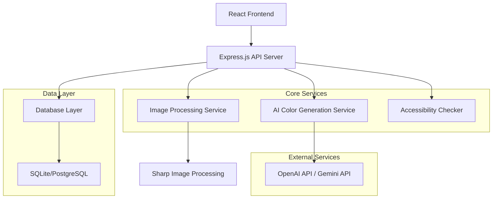

# ChromaGen Design Document

## Overview

ChromaGen is a web-based application that leverages AI to generate accessible color palettes from text prompts and images. The system combines a modern React frontend with a Node.js backend, integrating multiple AI services for color generation and image processing. The architecture prioritizes performance, accessibility compliance, and user experience while maintaining clean, maintainable code.

## Architecture

### High-Level Architecture



### Technology Stack

**Frontend:**
- React 18 with TypeScript
- Tailwind CSS for styling
- Framer Motion for animations
- React Query for state management
- Vite for build tooling

**Backend:**
- Node.js with Express.js
- TypeScript for type safety
- Sharp for image processing
- Multer for file uploads
- Rate limiting with express-rate-limit

**AI Integration:**
- OpenAI API for text-to-color generation
- Google Gemini API as fallback
- Custom color harmony algorithms
- WCAG contrast ratio calculations

**Database:**
- SQLite for development
- PostgreSQL for production
- Prisma ORM for database management

## Components and Interfaces

### Frontend Components

#### 1. Main Application Shell
```typescript
interface AppShellProps {
  children: React.ReactNode;
}

// Navigation, header, and main content wrapper
```

#### 2. Prompt Input Component
```typescript
interface PromptInputProps {
  onSubmit: (prompt: string) => void;
  isLoading: boolean;
  placeholder?: string;
}

// Handles text input with validation and submission
```

#### 3. Image Upload Component
```typescript
interface ImageUploadProps {
  onImageUpload: (file: File) => void;
  acceptedFormats: string[];
  maxSize: number;
  isLoading: boolean;
}

// Drag-and-drop image upload with preview
```

#### 4. Color Palette Display
```typescript
interface ColorPaletteProps {
  palette: ColorPalette;
  showAccessibilityInfo: boolean;
  onColorCopy: (color: Color) => void;
}

interface ColorPalette {
  id: string;
  name: string;
  prompt: string;
  colors: Color[];
  accessibilityScore: AccessibilityScore;
  createdAt: Date;
}

interface Color {
  hex: string;
  rgb: RGB;
  hsl: HSL;
  name: string;
  category: 'primary' | 'secondary' | 'accent';
  usage: string;
}
```

#### 5. Accessibility Panel
```typescript
interface AccessibilityPanelProps {
  palette: ColorPalette;
  colorBlindnessSimulation: boolean;
}

interface AccessibilityScore {
  overallScore: 'AA' | 'AAA' | 'FAIL';
  contrastRatios: ContrastRatio[];
  colorBlindnessCompatible: boolean;
  recommendations: string[];
}
```

#### 6. Export Dropdown
```typescript
interface ExportDropdownProps {
  palette: ColorPalette;
  formats: ExportFormat[];
  onExport: (format: ExportFormat) => void;
}

type ExportFormat = 'css' | 'scss' | 'json' | 'ase' | 'sketch' | 'figma';
```

#### 7. History Panel
```typescript
interface HistoryPanelProps {
  palettes: ColorPalette[];
  onPaletteSelect: (palette: ColorPalette) => void;
  onPaletteDelete: (id: string) => void;
}
```

### Backend API Endpoints

#### Color Generation Endpoints
```typescript
// POST /api/generate/text
interface TextGenerationRequest {
  prompt: string;
  userId?: string;
  options?: GenerationOptions;
}

// POST /api/generate/image
interface ImageGenerationRequest {
  image: File;
  userId?: string;
  options?: GenerationOptions;
}

interface GenerationOptions {
  colorCount: number;
  harmonyType: 'complementary' | 'triadic' | 'analogous' | 'monochromatic';
  accessibilityLevel: 'AA' | 'AAA';
}
```

#### Palette Management Endpoints
```typescript
// GET /api/palettes/history/:userId
// POST /api/palettes/save
// DELETE /api/palettes/:id
// GET /api/palettes/:id/export/:format
```

### Core Services

#### 1. AI Color Generation Service
```typescript
class ColorGenerationService {
  async generateFromText(prompt: string): Promise<ColorPalette>;
  async generateFromImage(imageBuffer: Buffer): Promise<ColorPalette>;
  private async callAIService(prompt: string): Promise<Color[]>;
  private applyColorHarmony(baseColors: Color[]): Color[];
  private generateColorNames(colors: Color[]): string[];
}
```

#### 2. Image Processing Service
```typescript
class ImageProcessingService {
  async extractDominantColors(imageBuffer: Buffer): Promise<Color[]>;
  async resizeImage(imageBuffer: Buffer, maxSize: number): Promise<Buffer>;
  async validateImageFormat(imageBuffer: Buffer): Promise<boolean>;
}
```

#### 3. Accessibility Checker Service
```typescript
class AccessibilityService {
  calculateContrastRatio(color1: Color, color2: Color): number;
  checkWCAGCompliance(palette: ColorPalette): AccessibilityScore;
  simulateColorBlindness(palette: ColorPalette, type: ColorBlindnessType): ColorPalette;
  generateAccessibilityRecommendations(palette: ColorPalette): string[];
}
```

## Data Models

### Database Schema

```sql
-- Users table (optional for history tracking)
CREATE TABLE users (
  id UUID PRIMARY KEY DEFAULT gen_random_uuid(),
  session_id VARCHAR(255) UNIQUE,
  created_at TIMESTAMP DEFAULT CURRENT_TIMESTAMP
);

-- Color palettes table
CREATE TABLE color_palettes (
  id UUID PRIMARY KEY DEFAULT gen_random_uuid(),
  user_id UUID REFERENCES users(id),
  name VARCHAR(255),
  prompt TEXT,
  colors JSONB NOT NULL,
  accessibility_score JSONB,
  created_at TIMESTAMP DEFAULT CURRENT_TIMESTAMP,
  updated_at TIMESTAMP DEFAULT CURRENT_TIMESTAMP
);

-- Export history table
CREATE TABLE export_history (
  id UUID PRIMARY KEY DEFAULT gen_random_uuid(),
  palette_id UUID REFERENCES color_palettes(id),
  format VARCHAR(50),
  exported_at TIMESTAMP DEFAULT CURRENT_TIMESTAMP
);
```

### Color Data Structure
```typescript
interface ColorData {
  hex: string;
  rgb: { r: number; g: number; b: number };
  hsl: { h: number; s: number; l: number };
  name: string;
  category: 'primary' | 'secondary' | 'accent';
  usage: string;
  accessibility: {
    contrastWithWhite: number;
    contrastWithBlack: number;
    wcagLevel: 'AA' | 'AAA' | 'FAIL';
  };
}
```

## Error Handling

### Frontend Error Handling
```typescript
// Global error boundary for React components
class ErrorBoundary extends React.Component {
  // Handle component errors gracefully
}

// API error handling with user-friendly messages
const handleAPIError = (error: APIError) => {
  switch (error.code) {
    case 'RATE_LIMIT_EXCEEDED':
      return 'Too many requests. Please wait a moment.';
    case 'INVALID_API_KEY':
      return 'Service temporarily unavailable. Please try again.';
    case 'IMAGE_TOO_LARGE':
      return 'Image is too large. Please use an image under 5MB.';
    default:
      return 'Something went wrong. Please try again.';
  }
};
```

### Backend Error Handling
```typescript
// Centralized error handling middleware
const errorHandler = (err: Error, req: Request, res: Response, next: NextFunction) => {
  logger.error(err);
  
  if (err instanceof ValidationError) {
    return res.status(400).json({ error: err.message });
  }
  
  if (err instanceof RateLimitError) {
    return res.status(429).json({ error: 'Rate limit exceeded' });
  }
  
  return res.status(500).json({ error: 'Internal server error' });
};
```

## Testing Strategy

### Unit Testing
- **Frontend**: Jest + React Testing Library for component testing
- **Backend**: Jest + Supertest for API endpoint testing
- **Services**: Mock external API calls for reliable testing

### Integration Testing
- End-to-end palette generation workflow
- Image upload and processing pipeline
- Export functionality across all formats

### Accessibility Testing
- Automated WCAG compliance testing
- Color contrast validation
- Screen reader compatibility testing

### Performance Testing
- Load testing for concurrent palette generation
- Image processing performance benchmarks
- API response time monitoring

### Test Coverage Goals
- Minimum 80% code coverage
- 100% coverage for accessibility calculations
- Critical path testing for all user workflows

## Security Considerations

### API Key Management
```typescript
// Environment-based configuration
const config = {
  openai: {
    apiKey: process.env.OPENAI_API_KEY,
    organization: process.env.OPENAI_ORG_ID,
  },
  gemini: {
    apiKey: process.env.GEMINI_API_KEY,
  },
};

// API key validation on startup
const validateAPIKeys = () => {
  if (!config.openai.apiKey) {
    throw new Error('OPENAI_API_KEY is required');
  }
};
```

### Input Validation
- Sanitize all user inputs
- Validate image file types and sizes
- Rate limiting on API endpoints
- CORS configuration for production

### Data Privacy
- No persistent storage of uploaded images
- Optional user session tracking
- GDPR-compliant data handling
- Secure deletion of temporary files

## Performance Optimization

### Frontend Optimization
- Code splitting with React.lazy()
- Image optimization and lazy loading
- Memoization of expensive calculations
- Virtual scrolling for large palette histories

### Backend Optimization
- Response caching for common prompts
- Image processing queue for large files
- Database indexing on frequently queried fields
- Connection pooling for database access

### AI Service Optimization
- Prompt caching to reduce API calls
- Fallback service implementation
- Request batching where possible
- Timeout handling for external services

## Deployment Architecture

### Development Environment
```yaml
# docker-compose.yml
version: '3.8'
services:
  frontend:
    build: ./frontend
    ports:
      - "3000:3000"
    environment:
      - REACT_APP_API_URL=http://localhost:3001
  
  backend:
    build: ./backend
    ports:
      - "3001:3001"
    environment:
      - DATABASE_URL=postgresql://user:pass@db:5432/chromagen
      - OPENAI_API_KEY=${OPENAI_API_KEY}
    depends_on:
      - db
  
  db:
    image: postgres:15
    environment:
      - POSTGRES_DB=chromagen
      - POSTGRES_USER=user
      - POSTGRES_PASSWORD=pass
```

### Production Considerations
- Container orchestration with Docker
- Load balancing for high availability
- CDN for static asset delivery
- Database backup and recovery procedures
- Monitoring and logging infrastructure